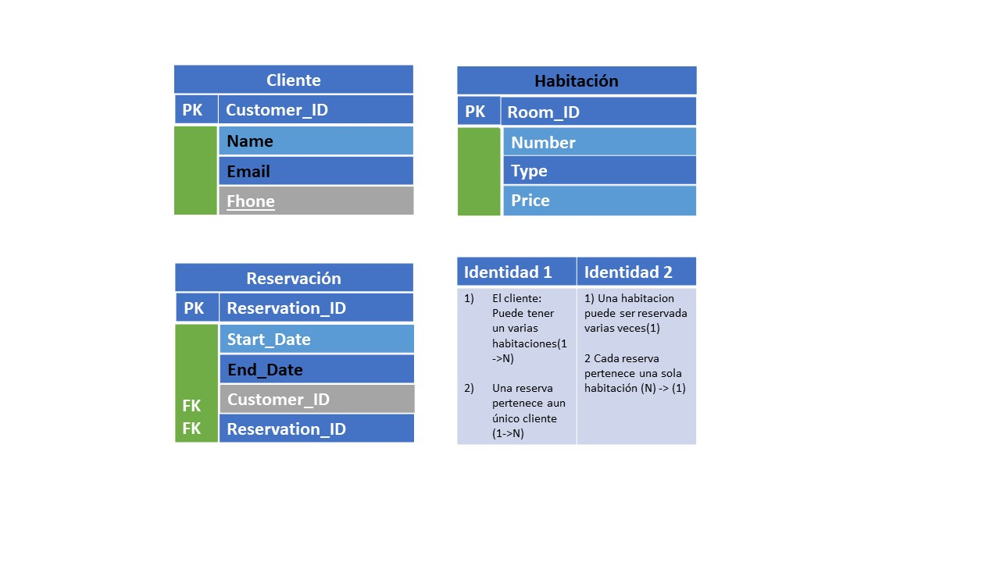

## Clase 1 Jorge Tonguino

1. En el punto uno le presento la lista de las mascotas.

2. En la imagende de nombre segundo punto de la tarea la paso ER donde presnetamos la realcion en una biblioteca, para ello la comformamos por el BooK_id y el Author_id, s vemos en esta elcion el Book_id es el PK y el Uthor_id es el FK,  un autor puede escribir muchos libros y un libor puede teten un solo autor.

3. Aqui tenemos la reacion entre Customer_id, Room_id y Reservation_id, donde la reacion se hace atraves de la llave forane FK para Curse_id y Student_ID resiven una llave foranea que le permite a un estudiante tener muchos cursos y a un curso tener muchos estudiantes.

