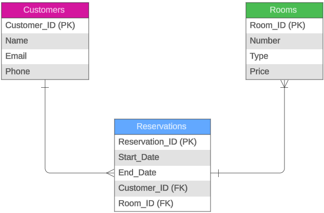

# Tarea 1 - Diagramas Entidad-Relación

## Punto 1: Modelo ER Básico - Pet Store (sin relaciones)

Para este ejemplo de modelo ER básico, se tomará como punto de partida la información elemental en una tienda de mascotas la cual hace el registro de sus clientes con base en ciertos datos que deben ser recopilados para el correcto registro de cada una de las mascotas que requieren algún servicio de la tiena. Este registro permitirá tener un acceso más fácil y rápido a la informacióm lo que permitirá dar un mejor servicio al propietario de la mascota.

Para este modelo ER, se tiene como Primary key (PK) un ID único y general asignado a cada mascota (Pet_ID) que permitirá una búsqueda rápida y única de toda la información asignada a esa mascota en particular. El modelo ER obtenido se presenta a conitnuación en la imagen 1.1.

## Punto 2: Modelo ER Básico - Library

Para este segundo ejemplo de un modelo de ER, ahora se relacionan dos tablas diferentes con las cuales se busca establecer una relación para permitir una búsqueda más óptima y precisa de la información. Para este ejmplo puntual, se tienen dos tablas, la primera, detalla la información relacionada a Autores de libros en la cual se tienen datos como: el ID del autor (actúa como llave princiapl), el nombre del autor, la nacionalidad del autor y como parte de la relación con la segunda tabla, se incluye un campo de ID de libro escrito o autoría (este atributo actúa como llave foránea). 

Por otra parte, se tiene una segunda tablala cual contiene la información relacionada a los libros escritos por diferentes autores, para este ejmplo, la relación que se establece sería: De uno a muchos: Un único autor podría escribir muchos libros. La tabla de libros tendría los siguientes campos: ID del libro (que actúa como llave primaria), el título del libro, el género al cual pertenece y la fecha de publicación. En la imagen 2.1 se puede observar el diagrama de ER establecido entre las dos tablas.

## Punto 3: Modelo ER Complejo - Hotel Reservation System

Para este tercer ejemplo, se requiere crear un diagrama o modelo ER un poco más complejo en el cual se involucran 3 diferentes tablas: Clientes, Reservaciones y Habitaciones. AL tenerse una mayor cantidad de tablas, las relaciones tienen a ser más complejas y se debe enteder muy bien de qué manera se relacionan entre sí para posteriormente crear de manera acertada las diferentes bases de datos y que las consultas se realicen de manera correcta. 

Para este escenario, se establecieron las siguientes relaciones:

- Un único cliente puede tener una o más reservas en el mismo hotel, sin embargo, una reserva está asociada únicamente a un cliente, por lo tanto está relación es de uno (Cliente) a muchos (Reservaciones).

- Adicional, una única reserva puede contener una o más habitaciones, sin embargo, una habitación solamente puede estar asociada a una reserva, por lo tanto esta relación sería de uno (Reservación) a muchos (Habitaciones).

De esta manera, se establece una relación acorde al escenario planteado entre las tres tablas dadas. Para este ejmplo, las llaves primarias son los IDs asociados a: cliente, reserva y habitación, adicional, las llaves foráneas se establecen en la tabla de reservaciones como_ ID del cliente y ID de la habitación. El modelo obtenido se presenta en la imagen 3.1.

