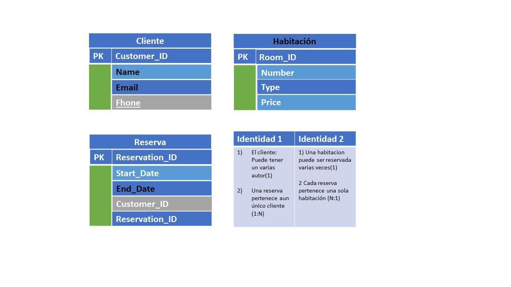

## Tienda de Mascota : 
le adjunto imagen.

+-----------+   +----------+  +---------+  +-----------------+   +------+
| Pet_ID    |   |Name      |  | Species |  |Breed            |   | Age  |
+-----------+   +----------+  +---------+  +-----------------+   +------+
|Pet_ID 001 |   |Max       |  | Dog     |  |Golden Retriever |   | 5    |
|Pet_ID 002 |   |Whiskers  |  | Cat     |  |Maine Coon       |   | 3    |
|Pet_ID 003 |   |Fluffy    |  | Rabbit  |  |Lionhead         |   | 2    |
|Pet_ID 004 |   |Tweety    |  | Bird    |  |Canary           |   | 1    |
|Pet_ID 005 |   |Bella     |  | Dog     |  |French Bulldog   |   | 4    |
+-----------+   +----------+  +---------+  +-----------------+   +------+

## 2 relacion de dos entidades

## Relación de tres intedades

Profe aqui pude Presento mi trabajo.