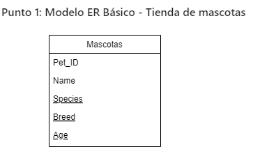
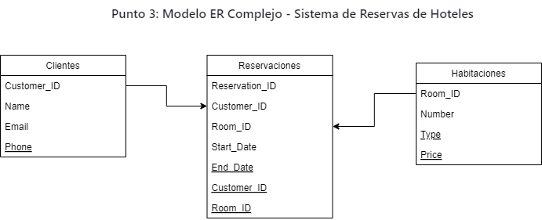

# Desarrollo de la Tarea 01

## Punto 1: Modelo ER Básico - Tienda de mascotas (sin relaciones)
Modelo entidad-relación (ER) básico para una tienda de mascotas que maneja la información sobre las mascotas, sin incluir relaciones:

Entidad: Mascotas
Pet_ID (Identificador único de la mascota)
Name (Nombre de la mascota)
Species (Especie de la mascota)
Breed (Raza de la mascota)
Age (Edad de la mascota)

Esquema de una tabla en una base de datos donde se almacenaría la información de cada mascota en la tienda.
## Punto 2: Modelo ER Básico - Biblioteca
Para este modelo entidad-relación (ER) de una biblioteca que gestiona información sobre libros y autores, y siguiendo la relación descrita, donde un autor puede escribir uno o más libros, y cada libro tiene un único autor, tenemos el siguiente diseño:

Entidades:
Libros:

Book_ID (Primary Key)
Title
Genre
Publication_Date
Autores:

Author_ID (Primary Key)
Name
Nationality
Relación:

Un autor puede escribir uno o más libros, y cada libro tiene un único autor, lo que genera una relación de uno a muchos (1
) entre Autor y Libro.
En el modelo ER, esto se representa como una clave foránea (Foreign Key) en la entidad Libro que referencia a la entidad Autor

## Punto 3: Modelo ER Complejo - Sistema de Reservas de Hoteles
Entidades y Atributos:
Clientes (Customer):

Customer_ID: Identificador único del cliente.
Name: Nombre del cliente.
Email: Correo electrónico del cliente.
Phone: Teléfono de contacto del cliente.
Habitación (Room):

Room_ID: Identificador único de la habitación.
Number: Número de la habitación.
Type: Tipo de habitación (Ej. simple, doble, suite).
Price: Precio por noche de la habitación.
Reserva (Reservation):

Reservation_ID: Identificador único de la reserva.
Start_Date: Fecha de inicio de la reserva.
End_Date: Fecha de finalización de la reserva.
Customer_ID: Identificador del cliente (clave foránea que relaciona a Cliente).
Room_ID: Identificador de la habitación reservada (clave foránea que relaciona a Habitación).
Relaciones:
Relación entre Clientes y Reservas:

Un Cliente puede tener una o más Reservas.
Cada Reserva está asociada a un único Cliente.
Relación uno a muchos (1
) entre Cliente y Reserva.
Relación entre Habitación y Reserva:

Una Habitación puede ser reservada múltiples veces (en distintas fechas).
Cada Reserva está asociada a una única Habitación.
Relación uno a muchos (1
) entre Habitación y Reserva.

elaciones:
Customer_ID en la tabla Reserva es una clave foránea (FK) que referencia a la clave primaria (PK) Customer_ID en la tabla Cliente.
Room_ID en la tabla Reserva es una clave foránea (FK) que referencia a la clave primaria (PK) Room_ID en la tabla Habitación.
Diagrama ER (lógico):
Cliente 1---(N) Reserva (N)---1 Habitación
Este diagrama muestra que un Cliente puede realizar múltiples Reservas y cada Reserva corresponde a una Habitación, con una relación de uno a muchos en ambos casos.
