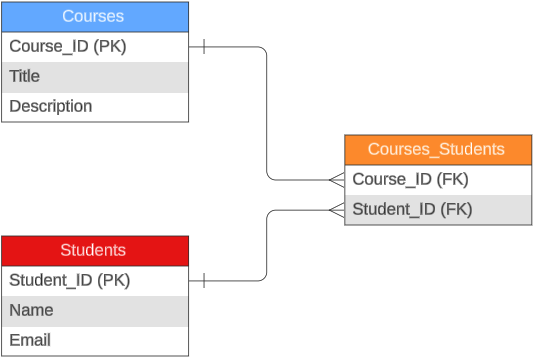
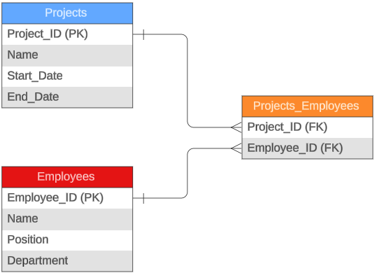
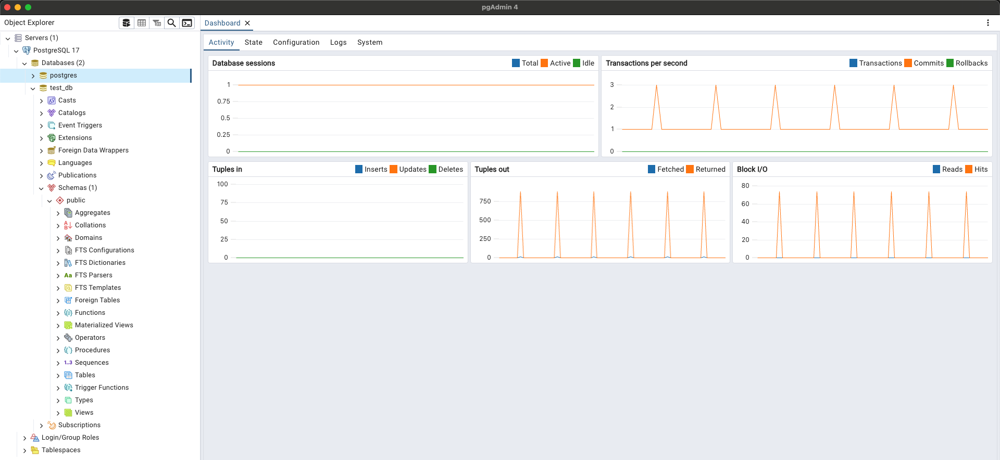

# Modelos ER con Relaciones Muchos a Muchos e Instalación de PostgreSQL

## Punto 1: Modelo ER Básico - Courses and Students

Para resolver este modelo ER de muchos a muchos, se requiere la creación de una tabla intermedia o de pivote la cual permite establecer  esa relación que se quiere establecer entre dos tablas principales mediantes las respectivas llaves foráneas que básicamente serían las llaves primarias de cada tabla, por lo tanto el modelo ER resulatnte se muestra a continuación en la imagen 2.1.

## Punto 2: Modelo ER Complejo - Projects and Employees

Para este ejemplo, la relación de muchos a muchos también requiere una tabla intermedia o pivote que sería: Courses_Employees, a través de esta tabla podemos establecer la relación que se requiere y facilita las diferentes búsquedas en la base de datos. El modelo ER que describe la relación muchos a muchos, se puede ver en la iamgen 2.2.

## Punto 3: Instalación de PostgreSQL y PGAdmin

Se realiza instalación de PostgreSQL y pgAdmin para la creación de base de datos, a contiinuación se adjunta la creación de test_db.

