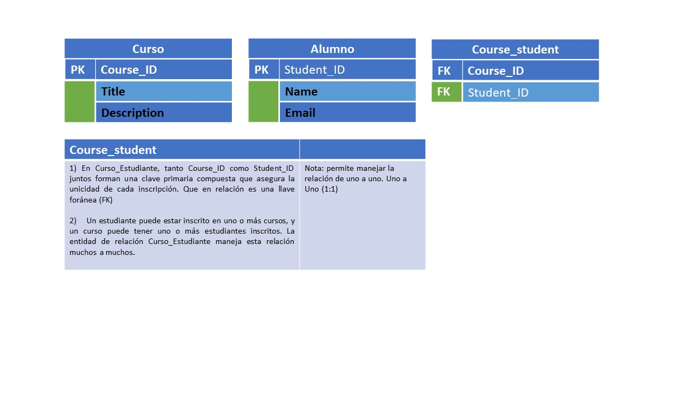
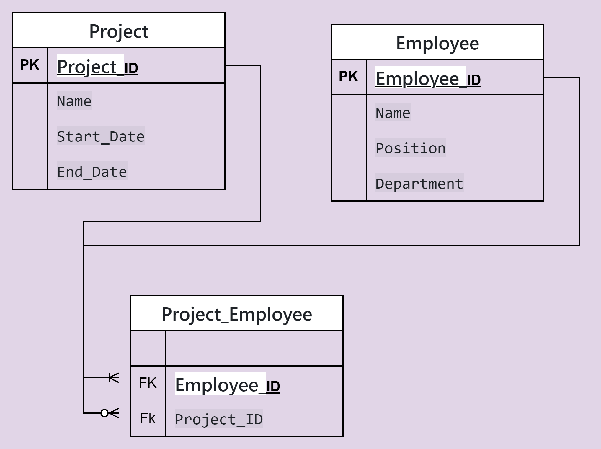
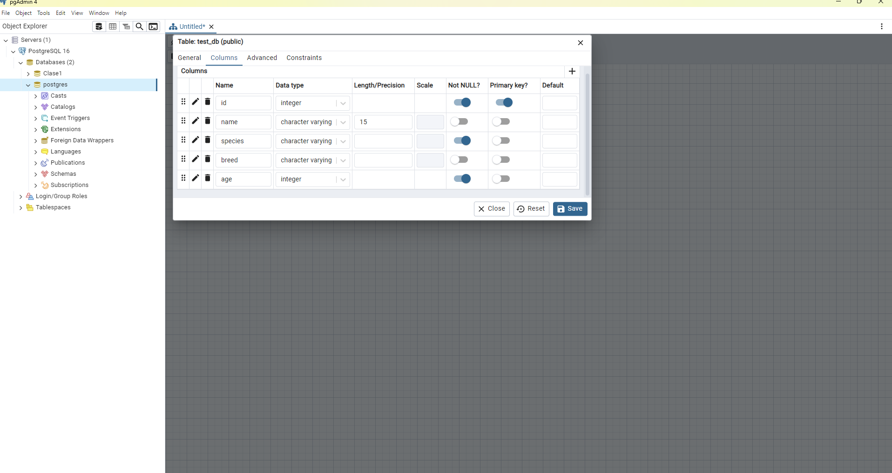

## Clase 2 base de datos relaciones de dos o mas entides.

1. Para hacer que dos entidades puedan tener relaciones de michos a muchos presentamos el siguiente ejercicio.

2. en esta tabla manejamos la RELACION  ER donde un empleado puede tener muchos proyectos a la vez como un proyecto tambienpuede tener empleados, para esto creamos otra tabla que nos permite crear una llave foranea como es FK.

3. se crea la base de datos test_db 
