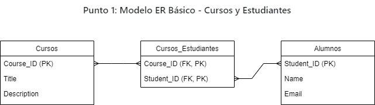
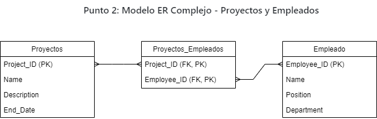
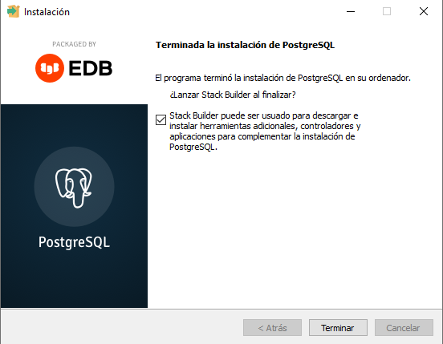
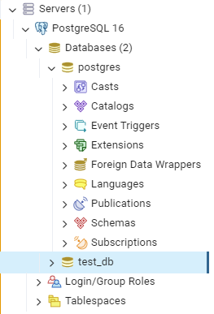

# Tarea: Modelos ER con Relaciones Muchos a Muchos e Instalación de PostgreSQL

## Punto 1: Modelo ER Básico - Cursos y Estudiantes
Diseño del modelo entidad-relación (ER) para el sistema de cursos y estudiantes con una relación muchos a muchos:

Tablas y Relaciones:
Curso:

Course_ID (PK) - Identificador único del curso.
Title - Título del curso.
Description - Descripción del curso.
Alumno:

Student_ID (PK) - Identificador único del estudiante.
Name - Nombre del estudiante.
Email - Correo electrónico del estudiante.
Curso_Estudiante (Entidad de relación para muchos a muchos):

Course_ID (FK, PK) - Llave foránea que referencia a la entidad Curso.
Student_ID (FK, PK) - Llave foránea que referencia a la entidad Alumno.
Diagrama en Texto:

## Descripción de las claves:
Course_ID (PK) en la tabla Curso es la clave primaria que identifica de forma única a cada curso.

Student_ID (PK) en la tabla Alumno es la clave primaria que identifica de forma única a cada estudiante.

Course_ID (FK) en la tabla Curso_Estudiante es una clave foránea que hace referencia a la clave primaria Course_ID en la tabla Curso.

Student_ID (FK) en la tabla Curso_Estudiante es una clave foránea que hace referencia a la clave primaria Student_ID en la tabla Alumno.

La tabla Curso_Estudiante tiene una clave primaria compuesta (PK) que está formada por Course_ID y Student_ID, lo que representa la relación muchos a muchos entre los estudiantes y los cursos.

## Punto 2: Modelo ER Complejo - Proyectos y Empleados
Diseño del modelo entidad-relación (ER) para el sistema de gestión de proyectos y empleados con una relación muchos a muchos:

Tablas y Relaciones:
Proyecto:

Project_ID (PK) - Identificador único del proyecto.
Name - Nombre del proyecto.
Start_Date - Fecha de inicio del proyecto.
End_Date - Fecha de finalización del proyecto.
Empleado:

Employee_ID (PK) - Identificador único del empleado.
Name - Nombre del empleado.
Position - Puesto del empleado.
Department - Departamento del empleado.
Proyecto_Empleado (Entidad de relación para muchos a muchos):

Project_ID (FK, PK) - Llave foránea que referencia a la entidad Proyecto.
Employee_ID (FK, PK) - Llave foránea que referencia a la entidad Empleado.
Diagrama en Texto:

## Descripción de las claves:
Project_ID (PK) en la tabla Proyecto es la clave primaria que identifica de forma única a cada proyecto.

Employee_ID (PK) en la tabla Empleado es la clave primaria que identifica de forma única a cada empleado.

Project_ID (FK) en la tabla Proyecto_Empleado es una clave foránea que hace referencia a la clave primaria Project_ID en la tabla Proyecto.

Employee_ID (FK) en la tabla Proyecto_Empleado es una clave foránea que hace referencia a la clave primaria Employee_ID en la tabla Empleado.

La tabla Proyecto_Empleado tiene una clave primaria compuesta (PK) formada por Project_ID y Employee_ID, lo que representa la relación muchos a muchos entre los empleados y los proyectos.
Relaciones:

Un proyecto puede estar asociado con uno o más empleados.

Un empleado puede estar asignado a uno o más proyectos.

La tabla Proyecto_Empleado es la tabla pivote que almacena la relación entre proyectos y empleados.

## Punto 3: Instalación de PostgreSQL y PGAdmin

Descripción : Instalar PostgreSQL y PGAdmin en sus computadoras.
Instrucciones :
Descargar e instalar PostgreSQL desde postgresql.org .
Descargar e instalar PGAdmin desde pgadmin.org .

Crear una base de datos de prueba en llamada PGAdmin test_db.

