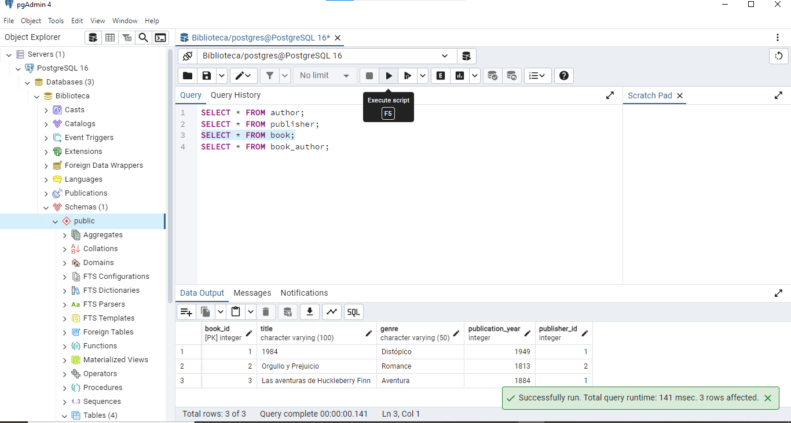
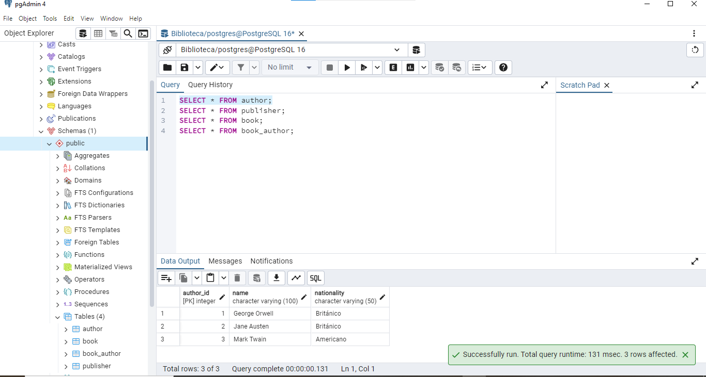
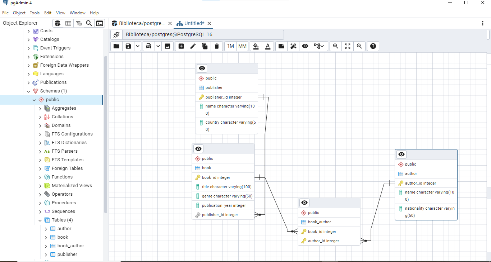

# Tarea: Creación de Tablas y Relaciones en SQL

Crear las tablas, definir las relaciones, e insertar los datos de ejemplo basados en el modelo entidad-relación proporcionado.

### Punto 1: Crear Tablas

### Creación de la tabla Autor
```
CREATE TABLE Author (
    Author_ID INT PRIMARY KEY,
    Name VARCHAR(100),
    Nationality VARCHAR(50)
);
```
### Creación de la tabla Publisher
```
CREATE TABLE Publisher (
    Publisher_ID INT PRIMARY KEY,
    Name VARCHAR(100),
    Country VARCHAR(50)
);
```
### Creación de la tabla Book
```
CREATE TABLE Book (
    Book_ID INT PRIMARY KEY,
    Title VARCHAR(100),
    Genre VARCHAR(50),
    Publication_Year INT,
    Publisher_ID INT,
    FOREIGN KEY (Publisher_ID) REFERENCES Publisher(Publisher_ID)
);
```
### Creación de la tabla Book_Author para la relación muchos a muchos
```
CREATE TABLE Book_Author (
    Book_ID INT,
    Author_ID INT,
    PRIMARY KEY (Book_ID, Author_ID),
    FOREIGN KEY (Book_ID) REFERENCES Book(Book_ID),
    FOREIGN KEY (Author_ID) REFERENCES Author(Author_ID)
);
```
# Punto 2: Insertar Datos

### Insertar datos en la tabla Author
```
INSERT INTO Author (Author_ID, Name, Nationality) VALUES
(1, 'George Orwell', 'Británico'),
(2, 'Jane Austen', 'Británico'),
(3, 'Mark Twain', 'Americano');
```
### Insertar datos en la tabla Publisher
```
INSERT INTO Publisher (Publisher_ID, Name, Country) VALUES
(1, 'Libros de pingüinos', 'Reino Unido'),
(2, 'Prensa de la Universidad de Oxford', 'Reino Unido');
```
### Insertar datos en la tabla Book
```
INSERT INTO Book (Book_ID, Title, Genre, Publication_Year, Publisher_ID) VALUES
(1, '1984', 'Distópico', 1949, 1),
(2, 'Orgullo y Prejuicio', 'Romance', 1813, 2),
(3, 'Las aventuras de Huckleberry Finn', 'Aventura', 1884, 1);
```

### Insertar datos en la tabla Book_Author (relación muchos a muchos)

```
INSERT INTO Book_Author (Book_ID, Author_ID) VALUES
(1, 1),
(2, 2),
(3, 3);
```

Instrucciones para la entrega:




