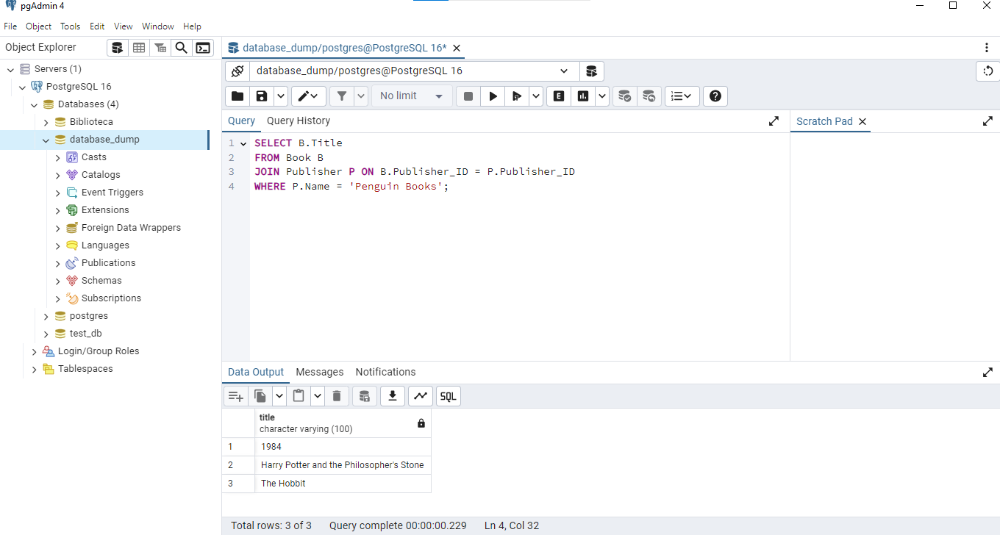
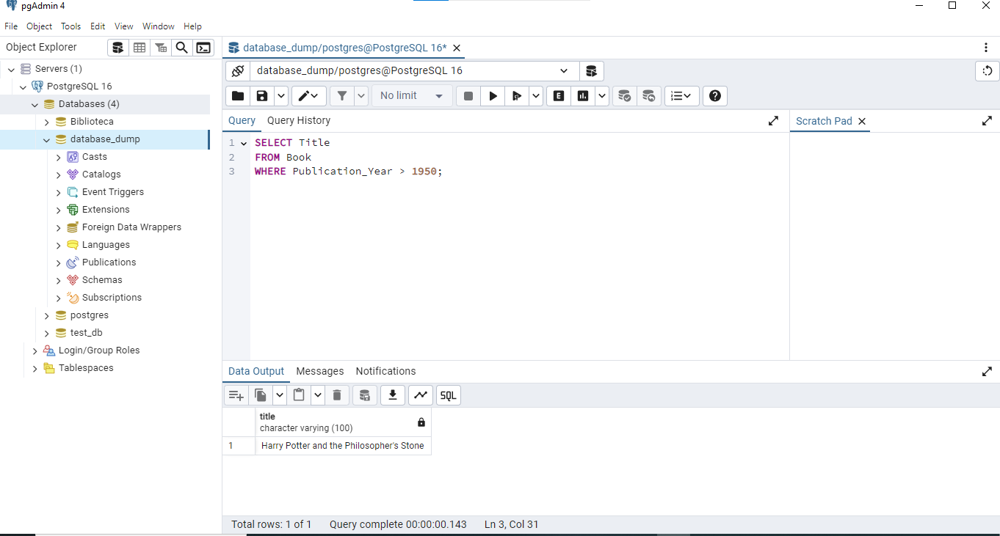
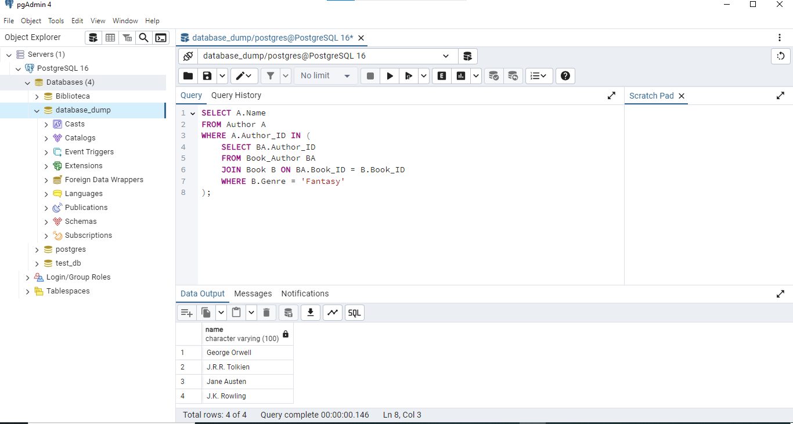
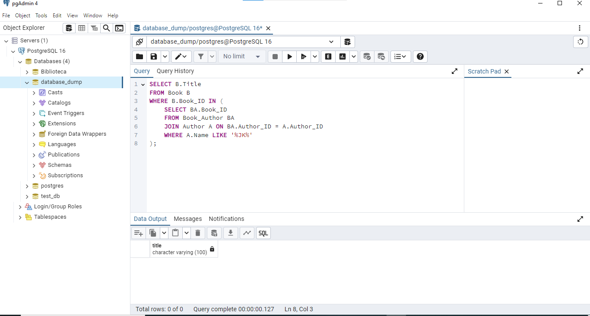

# Tarea: Practicando SELECT, UPDATE y DELETE en SQL

Crear las tablas, definir las relaciones, e insertar los datos de ejemplo basados en el modelo entidad-relación proporcionado.

## Punto 1: Crear Base de datos database_dump.sql

### Para completar esta tarea, los estudiantes deben tener acceso a una base de datos con la estructura y los datos de prueba proporcionados en el archivo database_dump.sql.
```
-- Crear tabla Author
CREATE TABLE Author (
    Author_ID INTEGER PRIMARY KEY,
    Name VARCHAR(100),
    Nationality VARCHAR(50)
);

-- Insertar datos en Author
INSERT INTO Author (Author_ID, Name, Nationality) VALUES
(1, 'George Orwell', 'British'),
(2, 'Jane Austen', 'British'),
(3, 'Mark Twain', 'American'),
(4, 'J.K. Rowling', 'British'),
(5, 'J.R.R. Tolkien', 'British');

-- Crear tabla Publisher
CREATE TABLE Publisher (
    Publisher_ID INTEGER PRIMARY KEY,
    Name VARCHAR(100),
    Country VARCHAR(50)
);

-- Insertar datos en Publisher
INSERT INTO Publisher (Publisher_ID, Name, Country) VALUES
(1, 'Penguin Books', 'United Kingdom'),
(2, 'Oxford University Press', 'United Kingdom'),
(3, 'HarperCollins', 'United States');

-- Crear tabla Book
CREATE TABLE Book (
    Book_ID INTEGER PRIMARY KEY,
    Title VARCHAR(100),
    Genre VARCHAR(50),
    Publication_Year INTEGER,
    Publisher_ID INTEGER,
    FOREIGN KEY (Publisher_ID) REFERENCES Publisher(Publisher_ID)
);

-- Insertar datos en Book
INSERT INTO Book (Book_ID, Title, Genre, Publication_Year, Publisher_ID) VALUES
(1, '1984', 'Dystopian', 1949, 1),
(2, 'Pride and Prejudice', 'Romance', 1813, 2),
(3, 'Adventures of Huckleberry Finn', 'Adventure', 1884, 3),
(4, 'Harry Potter and the Philosopher''s Stone', 'Fantasy', 1997, 1),
(5, 'The Hobbit', 'Fantasy', 1937, 1);

-- Crear tabla Book_Author (relación muchos a muchos entre Book y Author)
CREATE TABLE Book_Author (
    Book_ID INTEGER,
    Author_ID INTEGER,
    FOREIGN KEY (Book_ID) REFERENCES Book(Book_ID),
    FOREIGN KEY (Author_ID) REFERENCES Author(Author_ID),
    PRIMARY KEY (Book_ID, Author_ID)
);

-- Insertar datos en Book_Author
INSERT INTO Book_Author (Book_ID, Author_ID) VALUES
(1, 1),
(2, 2),
(3, 3),
(4, 4),
(5, 5),
(4, 1), -- George Orwell también es coautor de "Harry Potter and the Philosopher's Stone"
(5, 2); -- Jane Austen también es coautora de "The Hobbit"

```
## Punto 1: Generar Informes con SELECT

Informe 1 : Seleccionar todos los libros publicados por 'Penguin Books'.

# 1 Script
```
SELECT B.Title 
FROM Book B
JOIN Publisher P ON B.Publisher_ID = P.Publisher_ID
WHERE P.Name = 'Penguin Books';

```


Reporte 2 : Seleccionar todos los libros publicados después del año 1950.

# 2 Script
```
SELECT Title 
FROM Book 
WHERE Publication_Year > 1950;

```


Reporte 3 : Seleccionar los nombres de los autores que han escrito libros de género 'Fantasy' utilizando una subconsulta

# 3 Script
```
SELECT A.Name
FROM Author A
WHERE A.Author_ID IN (
    SELECT BA.Author_ID
    FROM Book_Author BA
    JOIN Book B ON BA.Book_ID = B.Book_ID
    WHERE B.Genre = 'Fantasy'
);

```


Reporte 4 : Seleccione los títulos de los libros escritos por autores cuyo nombre contenga 'JK' utilizando una subconsulta

# 4 Script
```
SELECT B.Title
FROM Book B
WHERE B.Book_ID IN (
    SELECT BA.Book_ID
    FROM Book_Author BA
    JOIN Author A ON BA.Author_ID = A.Author_ID
    WHERE A.Name LIKE '%JK%'
);

```


(Opcional) Reporte 5 : Utilizando una subconsulta, seleccione los títulos de los libros escritos por autores británicos.

# 5 Script
```
SELECT B.Title
FROM Book B
WHERE B.Book_ID IN (
    SELECT BA.Book_ID
    FROM Book_Author BA
    JOIN Author A ON BA.Author_ID = A.Author_ID
    WHERE A.Nationality = 'British'
);

```
![Reporte 5(img/Reporte5.png)

## Punto 2: Modificar Información con ACTUALIZAR

### Actualizar el género del libro '1984' a 'Ciencia ficción'.

```
UPDATE Book
SET Genre = 'Ciencia ficción'
WHERE Title = '1984';
```

### Cambiar la nacionalidad de 'Mark Twain' a 'canadiense'.

```
UPDATE Author
SET Nationality = 'Canadiense'
WHERE Name = 'Mark Twain';
```

## Punto 3: Eliminar Información con DELETE

### Eliminar el libro 'Orgullo y Prejuicio' de la base de datos.
```
DELETE FROM Book_Author
WHERE Book_ID = (SELECT Book_ID FROM Book WHERE Title = 'Pride and Prejudice');
```
### Eliminar los autores que no han escrito ningún libro.
```
DELETE FROM Book
WHERE Title = 'Pride and Prejudice';
```