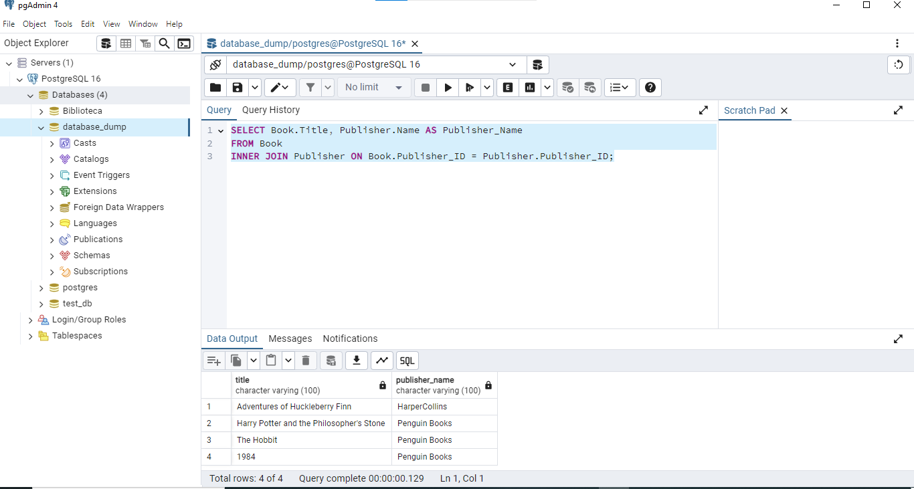
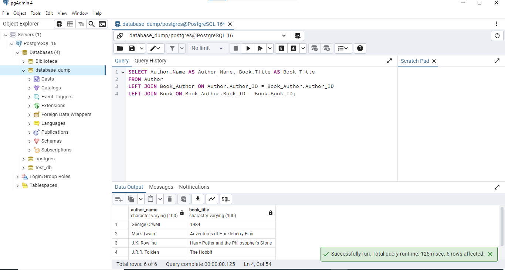
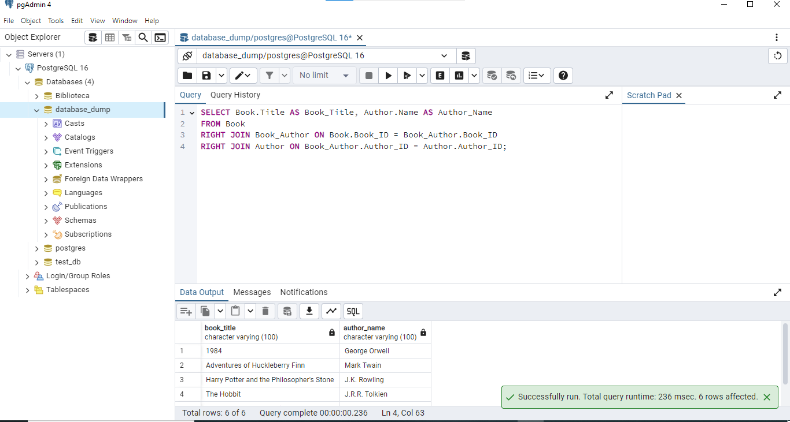
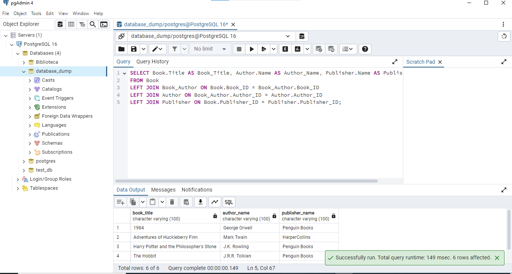
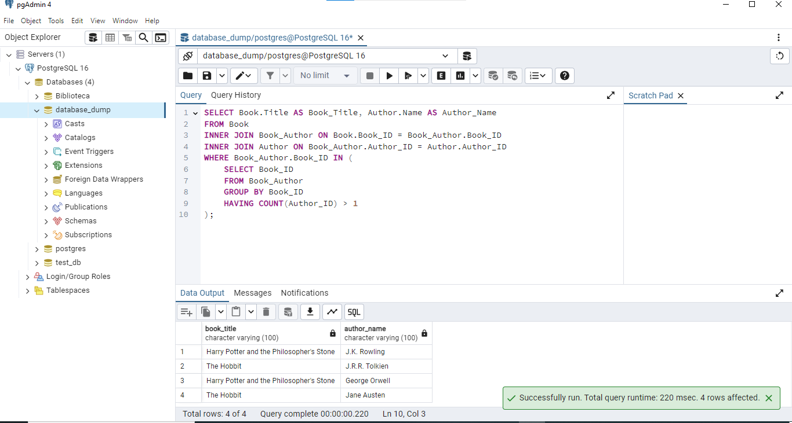
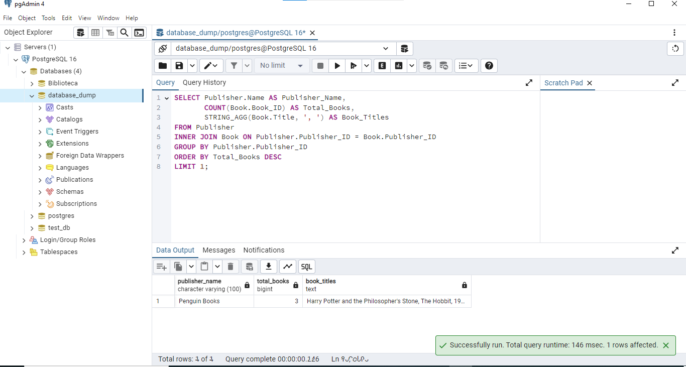

# Tarea: Practicando JOINs en SQL

Generar una serie de informes utilizando distintos tipos de JOINs para combinar información de varias tablas y practicar la integración de datos.

## Punto 1: Generar Reportes con JOINs


### Reporte 1 : Usar INNER JOINpara seleccionar los títulos de los libros junto con el nombre de su editorial.

```
SELECT Book.Title, Publisher.Name AS Publisher_Name
FROM Book
INNER JOIN Publisher ON Book.Publisher_ID = Publisher.Publisher_ID;
```


### Reporte 2 : Usar LEFT JOINpara seleccionar todos los autores y los títulos de los libros que han escrito, incluyendo autores que no han escrito ningún libro.

```
SELECT Author.Name AS Author_Name, Book.Title AS Book_Title
FROM Author
LEFT JOIN Book_Author ON Author.Author_ID = Book_Author.Author_ID
LEFT JOIN Book ON Book_Author.Book_ID = Book.Book_ID;
```


### Reporte 3 : Usar RIGHT JOINpara seleccionar todos los libros y los nombres de los autores que los han escrito, incluyendo libros que no tienen autores asociados.

```
SELECT Book.Title AS Book_Title, Author.Name AS Author_Name
FROM Book
RIGHT JOIN Book_Author ON Book.Book_ID = Book_Author.Book_ID
RIGHT JOIN Author ON Book_Author.Author_ID = Author.Author_ID;
```


### Reporte 4 : Usar una combinación de INNER JOINy LEFT JOINpara seleccionar todos los libros, sus autores, y la editorial, incluyendo libros que no tienen autores y aquellos sin editorial.

```
SELECT Book.Title AS Book_Title, Author.Name AS Author_Name, Publisher.Name AS Publisher_Name
FROM Book
LEFT JOIN Book_Author ON Book.Book_ID = Book_Author.Book_ID
LEFT JOIN Author ON Book_Author.Author_ID = Author.Author_ID
LEFT JOIN Publisher ON Book.Publisher_ID = Publisher.Publisher_ID;
```


### Reporte 5 : Usar INNER JOINpara seleccionar todos los libros que han sido escritos por más de un autor y mostrar el título del libro junto con los nombres de los autores.

```
SELECT Book.Title AS Book_Title, Author.Name AS Author_Name
FROM Book
INNER JOIN Book_Author ON Book.Book_ID = Book_Author.Book_ID
INNER JOIN Author ON Book_Author.Author_ID = Author.Author_ID
WHERE Book_Author.Book_ID IN (
    SELECT Book_ID
    FROM Book_Author
    GROUP BY Book_ID
    HAVING COUNT(Author_ID) > 1
);
```


### Reporte 6 (Opcional) : Usar INNER JOIN, LEFT JOIN, y GROUP BYpara seleccionar la editorial que tiene más libros publicados, junto con el número total de libros y los títulos de esos libros.

```
SELECT Publisher.Name AS Publisher_Name, 
       COUNT(Book.Book_ID) AS Total_Books, 
       STRING_AGG(Book.Title, ', ') AS Book_Titles
FROM Publisher
INNER JOIN Book ON Publisher.Publisher_ID = Book.Publisher_ID
GROUP BY Publisher.Publisher_ID
ORDER BY Total_Books DESC
LIMIT 1;
```



