# Creación de una API REST con Express usando Arrays en Memoria

Express: Utilizamos Express para crear la API REST. Es un marco minimalista que nos permite definir rutas y manejar solicitudes HTTP de forma sencilla.

Array en Memoria: Se usan dos arrays (movies  y directors ) para almacenar temporalmente los datos. Estos arrays se reinician cada vez que se reinicia el servidor

## Rutas de la API

## CRUD para Películas:

GET /movies: Devuelve todas las películas.
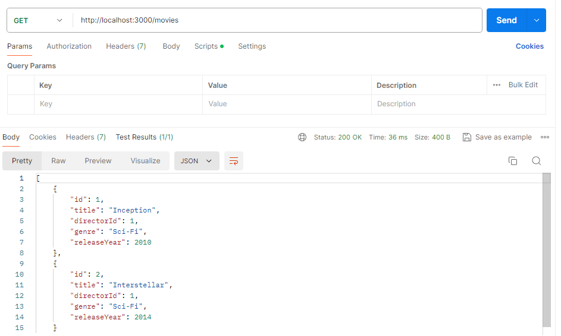
GET /movies/1
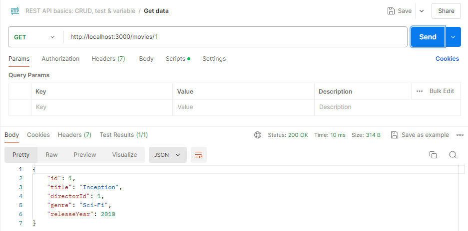
Devuelve una película específica por ID.

POST /movies: Crea una nueva película.
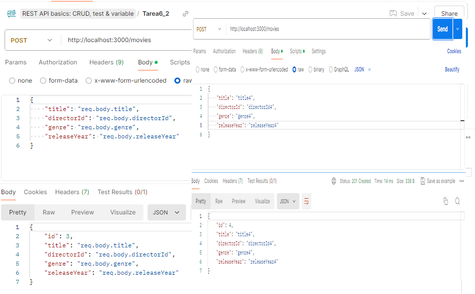
PUT /movies/
: Actualiza una película existente.
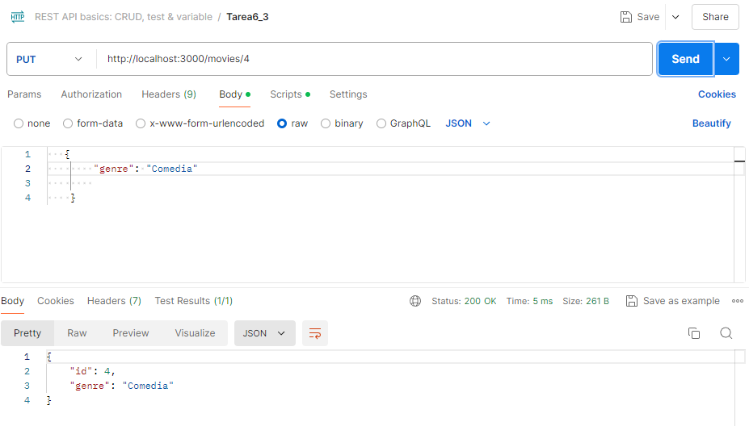
DELETE /movies/
: Elimina una película.
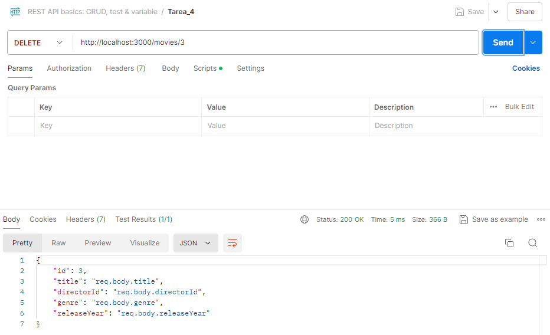    
## CRUD para Directores:
GET /directors: Devuelve todos los directores.
GET /directors/
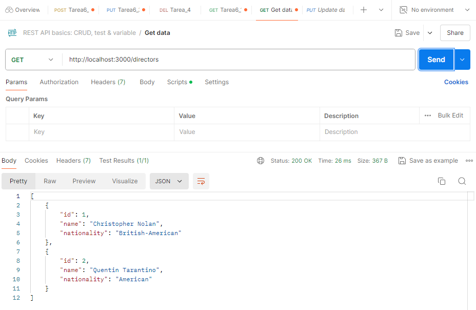 
: Devuelve un director específico por ID.
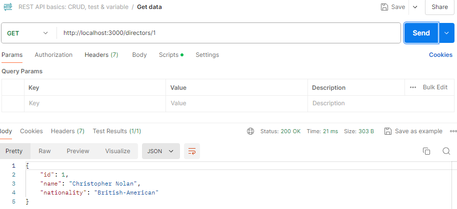 
POST /directors: Crea un nuevo director.
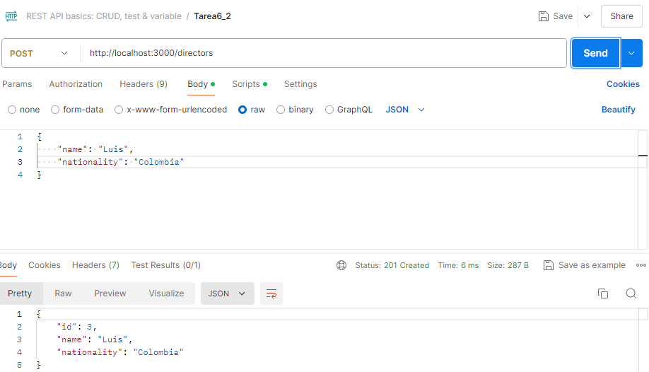 
PUT /directors/
: Actualiza un director existente.
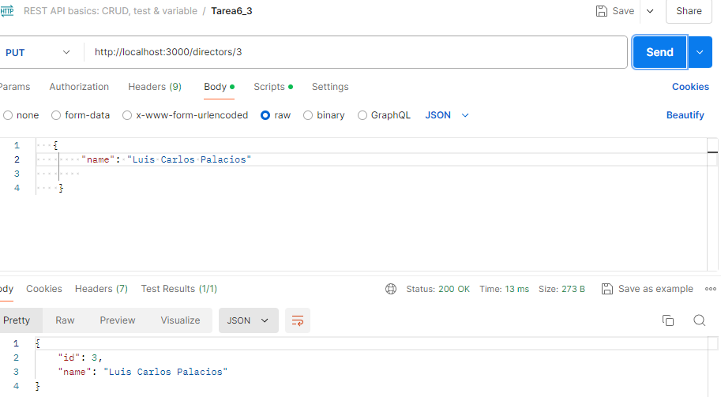 
DELETE /directors/
: Elimina un director.

Middleware: Se utiliza express.json() para permitir que el servidor procese JSON en las solicitudes POST y PUT

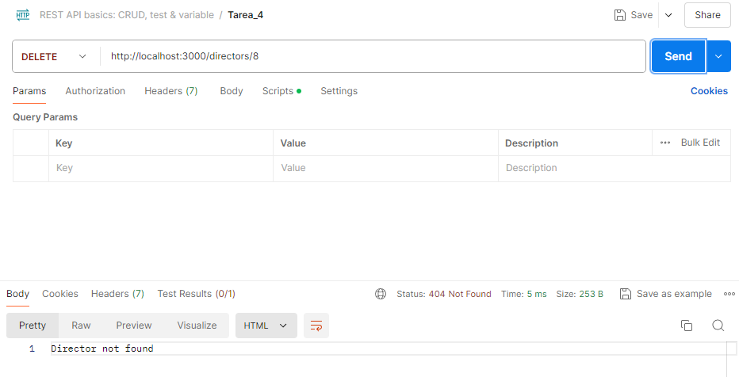

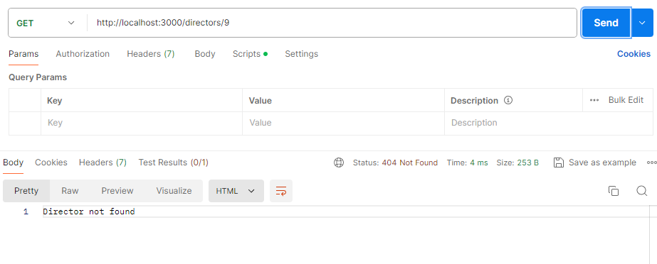
